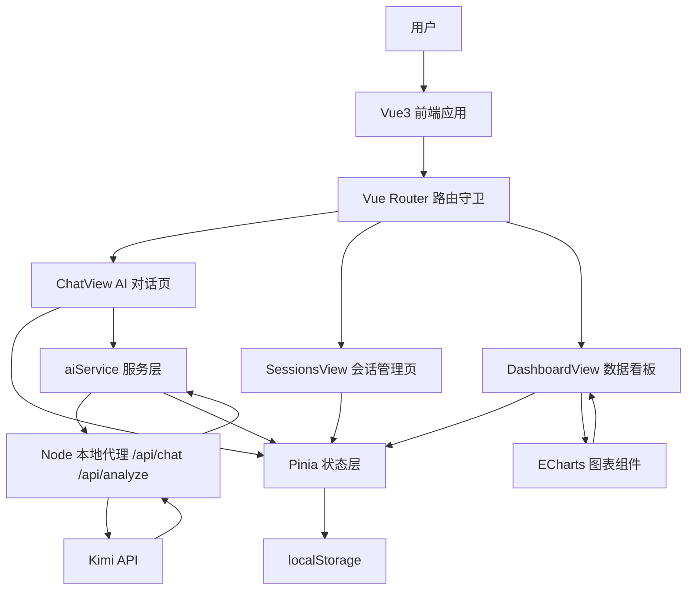
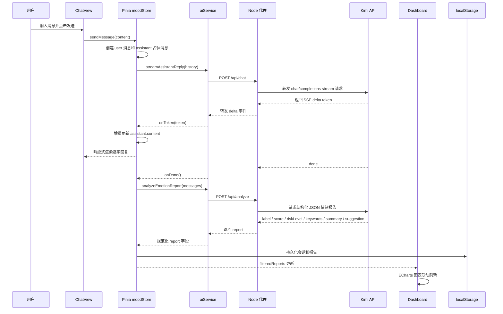

# MoodFlow 学习项目复盘

## 1. 项目定位

MoodFlow 是一个基于 Vue3 的 AI 情绪对话与数据分析平台，项目重点不是文档编辑，而是围绕 AI 对话数据构建完整的业务闭环：

- 用户通过聊天页输入近期状态。
- 前端通过本地 Node 代理调用 Kimi API，接收 SSE 流式回复。
- 对话结束后再次调用 Kimi 生成结构化情绪报告。
- Pinia 统一管理会话、消息、情绪报告、筛选条件和权限状态。
- Dashboard 根据筛选条件联动展示情绪趋势、分布、关键词排行和最近报告。

这个项目与 Markdown 在线编辑器形成差异化：

- Markdown 项目偏内容生产工具：编辑器集成、文档管理、导入导出。
- MoodFlow 偏 AI 数据应用：流式通信、状态同步、结构化分析、权限路由、可视化看板。

## 2. 技术栈

| 模块 | 技术 |
| --- | --- |
| 前端框架 | Vue3 + Vite + JavaScript |
| 状态管理 | Pinia |
| 路由 | Vue Router |
| 可视化 | ECharts |
| AI 接口 | Kimi / Moonshot OpenAI-compatible API |
| 本地代理 | Node.js HTTP Server |
| 内容渲染 | Markdown-it |
| 图标 | lucide-vue-next |
| 持久化 | localStorage |

## 3. 项目架构图



## 4. 核心数据流图



## 5. 目录结构

```text
src/
  components/
    EmotionBadge.vue       # 情绪标签组件
    MarkdownMessage.vue    # AI 回复 Markdown 渲染
    MetricCard.vue         # 看板指标卡
    TrendChart.vue         # ECharts 折线图 / 饼图
  layouts/
    AppShell.vue           # 应用侧边栏与页面外壳
  router/
    index.js               # 路由配置与权限守卫
  services/
    aiService.js           # AI 流式请求、结构化分析、mock fallback
  stores/
    auth.js                # 登录身份与权限状态
    mood.js                # 会话、消息、报告、筛选和流式状态
  views/
    LoginView.vue          # 登录页
    ChatView.vue           # AI 对话页
    DashboardView.vue      # 情绪数据看板
    SessionsView.vue       # 历史会话管理
    SettingsView.vue       # 系统设置
server/
  index.js                 # Node 本地代理，保护 API Key
  dev.js                   # 同时启动 API 代理和 Vite
```

## 6. 核心数据模型

```js
Session = {
  id: string,
  title: string,
  messages: Message[],
  report: EmotionReport | null,
  createdAt: number,
  updatedAt: number,
}

Message = {
  id: string,
  role: 'user' | 'assistant',
  content: string,
  createdAt: number,
  status: 'streaming' | 'done' | 'error',
}

EmotionReport = {
  label: '焦虑' | '低落' | '平静' | '积极' | '愤怒',
  score: number,
  riskLevel: 'low' | 'medium' | 'high',
  keywords: string[],
  summary: string,
  suggestion: string,
  source: 'kimi' | 'local',
}
```

## 7. 核心功能说明

### 7.1 Kimi 流式回复

前端通过 `fetch + ReadableStream` 请求本地 `/api/chat`，后端代理转发到 Kimi 的 OpenAI-compatible 接口。模型返回 SSE 数据后，前端逐个解析 `delta token` 并增量写入当前 assistant 消息，实现类似 ChatGPT 的逐字渲染。

关键点：

- `TextDecoder` 解码二进制流。
- 按 `\n\n` 拆分 SSE event。
- 解析 `data: {...}` 中的 `delta`。
- 通过 Pinia 响应式更新消息内容。
- 支持 AbortController 中断生成。

### 7.2 按会话隔离流式状态

项目没有使用单个全局 `isStreaming`，而是通过 `streamingMap` 和 `streamControllers` 按 `sessionId` 管理生成状态。

这样可以避免：

- 切换会话后 token 写入错误会话。
- A 会话生成中影响 B 会话操作。
- 中断生成时误中断其他会话。

### 7.3 结构化情绪分析

对话完成后，前端调用 `/api/analyze`，后端要求 Kimi 只返回 JSON：

```json
{
  "label": "焦虑",
  "score": 72,
  "riskLevel": "medium",
  "keywords": ["实习压力", "项目不完整", "简历反馈"],
  "summary": "用户因实习申请压力与项目不完整感焦虑",
  "suggestion": "先列最小可展示功能，每日推进一小步"
}
```

前端会对模型输出做规范化处理：

- 限制 label 枚举值。
- score 转成 0-100 整数。
- riskLevel 限制为 low / medium / high。
- keywords 截断长度。
- 如果接口失败，回退本地规则分析。

### 7.4 筛选联动看板

会话管理页和 Dashboard 共用 Pinia 中的 `filters` 状态：

- 关键词搜索。
- 情绪类型筛选。
- 风险等级筛选。
- 时间范围筛选。

Dashboard 不直接使用全部数据，而是基于 `filteredSessions / filteredReports` 派生图表数据，实现筛选条件和统计看板联动。

### 7.5 权限路由

通过 `authStore` 保存用户身份，结合 `router.beforeEach` 实现：

- 未登录访问业务页跳转登录页。
- 普通用户无法访问 Dashboard 和会话管理页。
- 管理员可以访问全部页面。

## 8. 面试可讲难点

1. **为什么不能把 API Key 放前端？**

   前端代码会被浏览器下载，任何写在前端的密钥都可能被用户看到。因此项目使用 Node 本地代理转发请求，前端只请求 `/api/chat` 和 `/api/analyze`。

2. **SSE 流式响应和普通请求有什么区别？**

   普通请求是一次性返回完整数据；SSE / stream 是服务端持续推送 token，前端边接收边渲染，需要处理分片、解码、终止和异常状态。

3. **如何避免切换会话时 token 写错位置？**

   每次发送消息时固定当前 `sessionId`，后续 onToken / onDone 都根据这个 id 查找目标会话，同时通过 `streamingMap[sessionId]` 判断该会话是否仍处于生成中。

4. **为什么要做结构化分析？**

   如果只让 AI 返回自然语言，Dashboard 无法稳定统计。结构化 JSON 把对话变成 label、score、risk、keywords 等可计算字段，才能支撑图表和筛选。

5. **为什么要有本地规则 fallback？**

   大模型接口可能失败、限流或返回非标准格式。fallback 可以保证演示链路不断，提升项目稳定性。

## 9. 简历关键词

- Kimi API
- SSE 流式响应
- fetch + ReadableStream
- Node 本地代理
- API Key 安全
- Pinia 状态管理
- 会话状态隔离
- AbortController
- 结构化 JSON 分析
- ECharts 数据看板
- 筛选联动
- Vue Router 权限守卫
